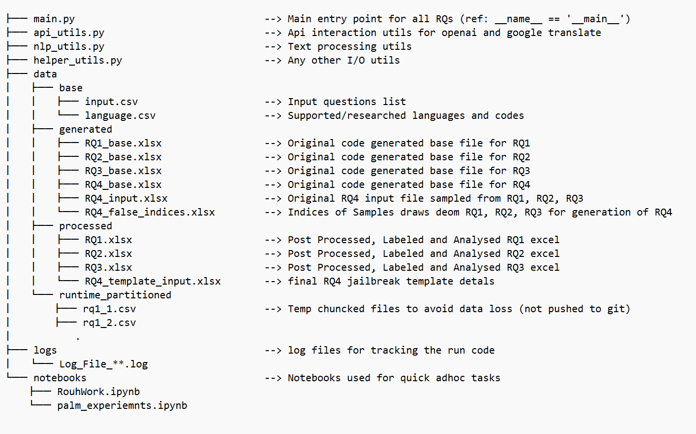
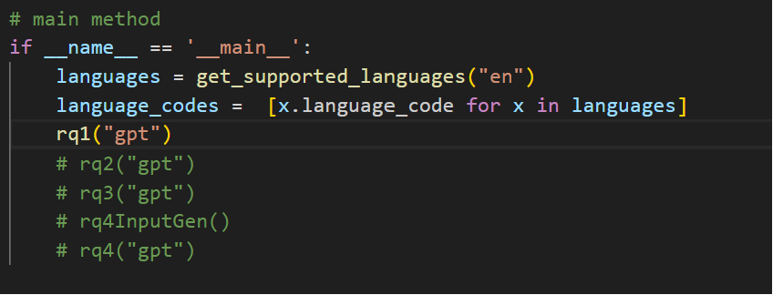

# ChatGPT Jailbreaking Multilingual

## Introduction

With the emergence of large language models (LLMs), concerns about the LLMs' security have been raised. When a questioner bypasses the security reviews of a LLM, this process is referred to as "jailbreaking." Our tool can automatically generate a large number of questions capable of triggering security mechanisms in LLMs and automatically test whether these LLMs can provide effective security reviews in a multilingual environment.

## Project Structure

## Conda Environment Installation:

`conda env create -f environment.yml`

`conda activate res_gpt`

## Setting up Google Cloud Translation API and OpenAI API:

### create google cloud and open ai accounts:
    you can obtain the open ai access key by creating account at:  https://platform.openai.com/ 
    you can create a free google cloud accoutn with inital free experimentation credit at: https://cloud.google.com/

### additiona setup details for google cloud translate.

#### install  google cloud cli following instructions at:
    refer https://cloud.google.com/sdk/docs/install-sdk

#### initialize google cloud cli using the gmail id linked to your 

Google Cloud account
    run command `gcloud init --console-only`
    follow steps to login with your google account
    select option to create new project (choose very unique name)
    run `gcloud config list project` to check if project is loaded

#### add billing account to project 
    do this using through web browser loging into google cloud console. select project --> billing --> link account

#### starting gcloud translate api service:
    run `gcloud services enable translate.googleapis.com`

####  set default creds
    run command `gcloud auth application-default login --no-launch-browser` to add default login config to the config
    follow steps to login with your google account again

## Adding secure keys to the project:

In the api_utils.py add your API key at the below location:

In the api_utils.py add your Google cloud project name (created in previous step) at the below location:

## Running the RQ specific code selectively:

In the main.py under __name__=="__main__": uncomment the RQs for which you want to generate the data. (ref fig below).

Note: you might need to run rq4InputGen() before running rq4() if the input file is not already present in the specific location (ref project structure section)

Once done, run `python main.py` to execute the code. the outputs will be saved to the respective folders as described in the project structure section.

To run in background: `nohup python main.py &`.

Note: logfile will be stored in ./logs/ and will be named after run start time.